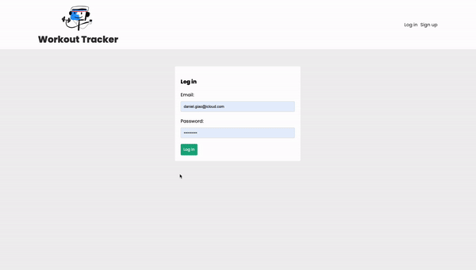

# mern-jwt-stack-app

A Full-Stack MERN app with secure login and registration using JWT that helps me track and manage my workout routines, and is effective for getting back in shape!

## Live Demo


## Technologies
- **Frontend :** React
- **Backend :** Node.js, Express
- **Database :** MongoDB
-  **Auth :** JWT

## Prerequisites
- **Node.js :** Make sure Node.js is installed. You can download it from [nodejs.org](https://nodejs.org/en).
- **MongoDB :** You need a MongoDB instance. You can use [MongoDB Atlas](https://www.mongodb.com/products/platform/atlas-database) for a cloud database or run MongoDB locally.
- **Git :** Ensure Git is installed to clone the repository.

## Getting Started
1. **Clone the Repository :**
```bash
git clone https://github.com/jaunewick/mern-jwt-stack-app.git
cd mern-jwt-stack-app
```
2.	**Install Dependencies :**

Navigate to both the frontend and backend directories and install dependencies :
```bash
cd frontend
npm install

cd ../backend
npm install
```

3. **Set Up MongoDB :**
- Create a .env file in the backend directory.
- Add your MongoDB connection string to the .env file:
```md
PORT=4000
MONGO_URI=<your-mongodb-connection-string>
SECRET=<your-jwt-secret>
```
4. **Run the Application :**

Start the backend server :
```bash
cd backend
npm run dev
```
In a separate terminal, start the frontend server :
```bash
cd frontend
npm start
```

5. **Access the App :**
Open your browser and go to http://localhost:3000 to see the app in action.
